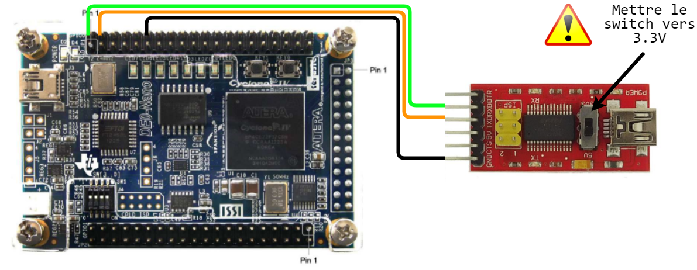

# Simulator Template
Dans ce dépôt vous allez trouver un projet modèle pour la carte DE0-Nano qui intègre le simulateur du voilier.
## Requirements
- Carte DE0-Nano
- Module FTDI GT1125 (ou autre module qui permet de convertir USB &rarr; UART)
## Getting started
- A l'aide de Quartus, ouvrez le projet **proj_sim.qsf** qui se trouve dans **rtl/proj_sim**. 
- Compilez le projet sans rien toucher au code.
- Faites les connection suivantes entre le convertisseur UART et la carte DE0 Nano

| FTDI | DE0 Nano | Équivalent VHDL | 
|------|----------|-----------------|
|Rx    |PIN_D3    |PinTx            |
|Tx    |PIN_C3    |PinRx            |
|GND   |GND       |-                |



**Vérifiez que le switch du FTDI est bien sur 3.3V (vers le haut par rapport à l'image au dessus).** 

- Téléversez le bitstream **proj_sim.sof** sur votre carte.

- Lancez le simulateur. En haut à gauche cliquez sur **Serial Port**.
    - Dans **Port**, choisissez le port série sur le quel votre FTDI est connecté
    - Dans **BaudRate** choisissez 1 000 000 bauds
    - Après avoir choisi le **Port** et **Baudrate**, cliquez sur **Open**

Après avoir appuyé sur **Serial Port &rarr; Open**, si vous répliquez sur **Serial Port**, à la place de **Open** vous devrez retrouver **Close**. Cela indique que le simulateur est connecté avec le FPGA.

Une autre méthode de savoir si vous etes connecté est de regarder le terminal. Lorsque vous appuyez sur **Serial Port &rarr; Open**, sur la sortie du terminal sera la suivante : 
```
INFO:root:Read at C0 4 [80 F0 FA 02] incr=True
INFO:root:Fpga freq = 50000000
```
Si le simulateur n'a pas réussi à se connecter avec le FPGA, le terminal aura la sortie suivante :
```
INFO:root:Read at C0 4 [] incr=True
INFO:root:Can't read Fpga frequency
```