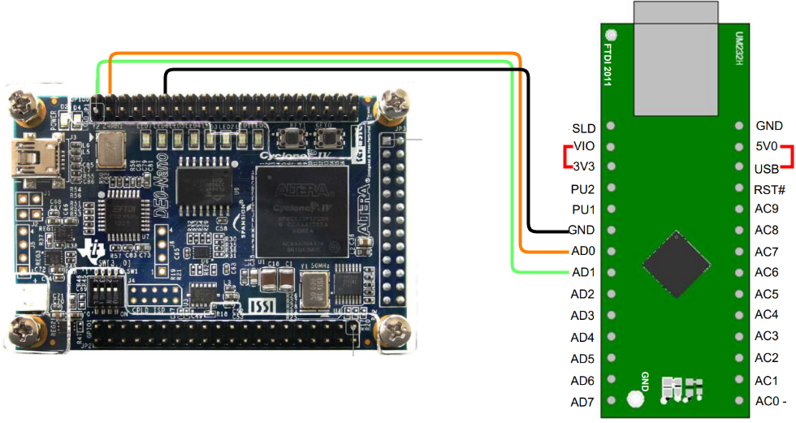

# Simulator Template
Dans ce dépôt vous allez trouver un projet modèle pour la carte DE0-Nano qui intègre le simulateur du voilier.
## Requirements
- Carte DE0-Nano
- Module FTDI ou UM232H (ou autre module qui permet de convertir USB &rarr; UART)
## Getting started
Clonez le dépôt.
```
$ git clone https://github.com/Master-EEA-SME/SailingBoatSimulatorTemplateFW
Cloning into 'SailingBoatSimulatorTemplateFW'...
$ git submodule update --init --recursive
Submodule 'rtl/IP/Simulator' (https://github.com/Master-EEA-SME/SailingBoatSimulatorFW) registered for path 'rtl/IP/Simulator'
...
```
- A l'aide de Quartus, ouvrez le projet **proj_sim.qsf** qui se trouve dans **rtl/proj_sim**. 
- Compilez le projet sans rien toucher au code.
- Faites les connection suivantes entre le convertisseur UART et la carte DE0 Nano
### FTDI GT1125
| FTDI | DE0 Nano | Équivalent VHDL | 
|------|----------|-----------------|
|RXD   |PIN_D3    |PinTx            |
|TXD   |PIN_C3    |PinRx            |
|GND   |GND       |-                |


**Vérifiez que le switch du FTDI est bien sur 3.3V (vers le haut par rapport à l'image au dessus).** 
### FTDI UM232H
| FTDI | DE0 Nano | Équivalent VHDL | 
|------|----------|-----------------|
|AD0   |PIN_C3    |PinRx            |
|AD1   |PIN_D3    |PinTx            |
|GND   |GND       |-                |



Ce module peut être alimenté de plusieurs façons. Voir la [documentation](https://ftdichip.com/wp-content/uploads/2020/07/DS_UM232H.pdf#page=16).

Pour l'alimenter par l'USB, **il faut alimenter le FTDI en connectant 3V3 &rarr; VIO et USB &rarr; 5V0.**

Ce module peut être configuré en plusieurs modes (UART, JTAG, SPI, ...). Voir [documentation](https://ftdichip.com/wp-content/uploads/2020/07/DS_UM232H.pdf#page=10).

#### Configuration de l'UM232H
Pour l'utiliser avec le simulateur, il faut configurer le UM232H en UART.
#### Windows
Aller dans *Gestionnaire de périphériques &rarr; Contrôleurs de bus USB &rarr; USB Serial Converter &rarr; Avancé* et cocher la case *Mettre en œuvre un port COM virtuel*. Après avoir valider la configuration, un périphérique *Ports (COM et LPT) &rarr; USB Serial Port (COMx)* doit exister.

#### Linux
Par défaut, l'UM232H a du être monté en UART. Il n'y a rien à faire. Si vous listez le device tree (dossier *dev*), vous devez trouver le fichier **ttyUSB0**.
```bash
$ ls -l /dev/ | grep ttyUSB*
...
crw-rw---- 1 root  dialout   4,  64 Nov 13 16:03 ttyUSB0
...
```
### Téléversement et test

- Téléversez le bitstream **proj_sim.sof** sur votre carte.

- Lancez le simulateur. En haut à gauche cliquez sur **Serial Port**.
    - Dans **Port**, choisissez le port série sur le quel votre FTDI est connecté
    - Dans **BaudRate** choisissez 1 000 000 bauds
    - Après avoir choisi le **Port** et **Baudrate**, cliquez sur **Open**

Après avoir appuyé sur **Serial Port &rarr; Open**, si vous répliquez sur **Serial Port**, à la place de **Open** vous devrez retrouver **Close**. Cela indique que le simulateur est connecté avec le FPGA.

Une autre méthode de savoir si vous etes connecté est de regarder le terminal. Lorsque vous appuyez sur **Serial Port &rarr; Open**, sur la sortie du terminal sera la suivante : 
```
INFO:root:Read at C0 4 [80 F0 FA 02] incr=True
INFO:root:Fpga freq = 50000000
```
Si le simulateur n'a pas réussi à se connecter avec le FPGA, le terminal aura la sortie suivante :
```
INFO:root:Read at C0 4 [] incr=True
INFO:root:Can't read Fpga frequency
```